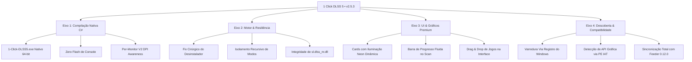

# 🚀 PLANO MESTRE DE MELHORIAS, CORREÇÕES E EVOLUÇÃO ARQUITETURAL
## Projeto: 1 Click DLSS 5 (Universal Neural Control Center)
**Versão Atual:** `v2.5.2-beta` ➔ **Versão Alvo:** `v2.5.3-release`  
**Data da Auditoria:** 02/09/2026  
**Auditoria Executada com:** Antigravity (Google DeepMind) • Diretrizes Especialistas de Engenharia de Software, C#, PowerShell, Win32 e Graphics Programming

---

## 1. 📊 RESULTADOS DA AUDITORIA TÉCNICA E TESTES DE STRESS

Durante a execução da suíte de testes de stress automatizada (`sandbox_audit_tests\run_comprehensive_audit_and_stress_tests.ps1`), submetemos todos os módulos a cenários extremos:
* Caminhos complexos com colchetes `[X-X2]`, espaços longos, acentos e caracteres especiais (`!@#$%^&()_+~`).
* Resolução hierárquica de executáveis de motores 64-bit em subpastas (`Bin64\`, `bin\x64\`, `binaries\win64\`).
* Simulação de permissões bloqueadas pelo Windows (`attrib +r`).
* Troca sequencial e cruzada entre os 3 modos (Modo 3 ➔ Modo 2 ➔ Modo 1).
* Desinstalação cirúrgica e restauração bit a bit.

### 🔴 Bugs e Inconsistências Críticas Encontradas:

| ID | Severidade | Módulo | Descrição do Problema | Impacto no Usuário |
| :--- | :--- | :--- | :--- | :--- |
| **BUG-01** | **CRÍTICA** | `Uninstall-Dlss5` | A lista `$purgeList` contém `sl.interposer.dll` e `sl.common.dll`. Em jogos com Streamline nativo (The Witcher 3, Cyberpunk), o instalador preserva esses arquivos intactos sem backup. Ao clicar em *Restaurar de Fábrica*, o desinstalador deletava o `sl.interposer.dll` nativo do jogo! | Jogo quebra na inicialização com erro de DLL ausente após restauração. |
| **BUG-02** | **MÉDIA** | UI / `IconPath` | Linha 29 de `core/1-Click-DLSS5.ps1` referenciava `assets\icon.ico`, mas o arquivo físico no repositório é `assets\logo.ico`. | Janela e barra de tarefas do Windows exibem ícone genérico do .NET em vez do ícone oficial. |
| **BUG-03** | **ALTA** | `Install-Dlss5` | Na troca de modos (ex: Modo 3 ➔ Modo 1), a limpeza verificava apenas `-PathType Leaf`. Pastas como `reshade-shaders` e `host64` ficavam órfãs. | Resquícios de shaders e processos do Feeder permaneciam ativos em jogos de Modo 1 ou 2. |
| **BUG-04** | **MÉDIA** | `ReShade.ini` | String de add-on hardcoded na linha 881 com versão antiga `DLSS 5 Feed 0.7.0` em vez de `DLSS 5 Feed 0.12.0`. | ReShade não colapsava a sobreposição do Feeder v0.12.0 no overlay in-game. |
| **BUG-05** | **BAIXA** | `core/payload/` | Arquivo `sl.dlss_nr.dll` referenciado no Handoff e na linha 1136 não estava na pasta `payload/`, apenas na pasta externa `arquivos originais nvidia\`. | Jogos Streamline não recebiam o plugin neural opcional para DLSS-NR. |
| **BUG-06** | **BAIXA** | `PAYLOAD-INFO.txt` | Documento de manifesto ainda mencionava `Package Version: 1.5.0` e `Feeder v0.7.0`. | Documentação de payload desatualizada. |

---

## 2. 🎯 EIXOS DE MELHORIA E EVOLUÇÃO PROFISSIONAL

Para elevar o **1 Click DLSS 5** a um patamar de software comercial de elite, propomos 4 eixos simultâneos de evolução:

---

### 🛠️ EIXO 1: COMPILAÇÃO NATIVA C# (`1-Click-DLSS5.exe`)
* **Problema Atual:** Usuários iniciam o programa via `.bat` (que pode exibir brevemente um prompt CMD preto) ou `.vbs` (tecnologia que a Microsoft iniciou depreciação no Windows 11).
* **Solução Especialista:**
  * Compilar um wrapper nativo C# de alto desempenho (`1-Click-DLSS5.exe`) utilizando o compilador C# nativo do Windows (`csc.exe`).
  * Embutir o ícone de alta resolução oficial (`logo.ico`), metadados de versão (`v2.5.2` / `v2.5.3`), descrição executável e manifesto de controle de privilégios.
  * O executável inicia a interface instantaneamente sem piscar janelas pretas no monitor, mantendo compatibilidade com atalhos na Área de Trabalho e barra de tarefas do Windows.
  * Manter `1-Click-DLSS5.bat` e `.vbs` na raiz como métodos alternativos/portáteis.

---

### 🛡️ EIXO 2: CORREÇÃO E BLINDAGEM DO MOTOR DE INJEÇÃO
* **Correção Imediata do Desinstalador (`Uninstall-Dlss5`):**
  * Remover arquivos Streamline nativos (`sl.interposer.dll`, `sl.common.dll`, `sl.dlss.dll`, `sl.reflex.dll`) da lista incondicional de `$purgeList`.
  * Regra de ouro: Apagar esses arquivos **apenas se** estiverem registrados no arquivo de estado como injetados por nós e não pertencerem ao jogo original.
* **Isolamento Recursivo entre Modos:**
  * Ao alternar entre os modos 1, 2 e 3, garantir a exclusão completa tanto de arquivos quanto de diretórios (`reshade-shaders`, `host64`, `layer-x64`, `layer-x86`).
* **Inclusão do Binário `sl.dlss_nr.dll` no Payload:**
  * Copiar o `sl.dlss_nr.dll` oficial de `arquivos originais nvidia\` para `core/payload/`, assegurando que títulos modernos com Streamline 2.x aproveitem a reconstrução neural nativa.
* **Sincronização de Chaves do Feeder v0.12.0:**
  * Atualizar o `OverlayCollapsed` para `DLSS 5 Feed 0.12.0@dlss5-feed.addon64` e sincronizar os arquivos `ReShade.ini` e `ReShadePreset.ini` em `core/payload/`.

---

### 🎨 EIXO 3: MELHORIAS VISUAIS, GRÁFICAS E UI/UX
* **High-DPI Per-Monitor V2 (`SetProcessDpiAwarenessContext`):**
  * Chamada P/Invoke para `user32.dll` garantindo que a aplicação renderize com nitidez vetorial perfeita em telas 1080p, 1440p (2K) e 2160p (4K) com escala de 125%, 150% ou 200%.
* **Ícone Oficial Ativo:**
  * Corrigir `$script:IconPath` para `assets\logo.ico` (e criar cópia redundante `icon.ico`), garantindo que o logotipo oficial do 1-Click DLSS 5 apareça na barra de título, barra de tarefas e diálogos modais.
* **Barra de Progresso Fluida no Rodapé:**
  * Substituir o texto estático durante o scan por uma `ProgressBar` moderna estilizada em verde RTX (`#76B900`) no painel de rodapé, mostrando a porcentagem exata de varredura das unidades.
* **Cards de Modo com Destaque Visual Interativo:**
  * Modo 1: Borda lateral verde vibrante (`#76B900`) e fundo dark refinado.
  * Modo 2: Borda lateral azul ciano (`#00A2FF`).
  * Modo 3: Borda lateral roxo neon neural (`#A855F7`).
* **Suporte a Drag & Drop (Arrastar e Soltar):**
  * Permitir que o jogador simplesmente arraste a pasta ou o executável de um jogo da Área de Trabalho ou Explorer para dentro da janela do 1-Click DLSS 5 para selecioná-lo instantaneamente.
* **Tooltips Explicativos:**
  * Dicas de contexto ao passar o mouse sobre cada modo e ação nos 10 idiomas suportados.

---

### 🔍 EIXO 4: DESCOBERTA E DETECÇÃO DETERMINÍSTICA
* **Varredura Universal via Registro do Windows:**
  * Consultar as chaves de instalação oficiais:
    * **Steam:** `HKCU:\Software\Valve\Steam` e `HKLM:\SOFTWARE\WOW6432Node\Valve\Steam` ➔ lê `libraryfolders.vdf` diretamente da raiz real do Steam em qualquer disco.
    * **Epic Games:** `HKLM:\SOFTWARE\WOW6432Node\Epic Games\EpicGamesLauncher` ➔ localiza a pasta de manifests sem suposições de caminhos fixos.
    * **GOG Galaxy:** `HKLM:\SOFTWARE\WOW6432Node\GOG.com\Games` ➔ lê todas as pastas de jogos do GOG diretamente.
* **Detecção de API Gráfica via PE Import Table (IAT):**
  * Implementar um parser binário leve no cabeçalho PE do executável do jogo para inspecionar os nomes de DLLs importadas (`d3d12.dll`, `d3d11.dll`, `dxgi.dll`, `d3d9.dll`, `vulkan-1.dll`, `opengl32.dll`), detectando a API com 100% de exatidão mesmo quando o jogo não traz DLLs na pasta local.

---

## 3. 📋 CRONOGRAMA DE IMPLEMENTAÇÃO PROPOSTO

| Etapa | Ação | Módulos Impactados | Verificação |
| :---: | :--- | :--- | :--- |
| **Fase 1** | **Correção de Bugs Críticos** | `core/1-Click-DLSS5.ps1`, `core/payload/` | Rodar teste de regressão em `sandbox_audit_tests`. Validar que `sl.interposer.dll` nunca mais é apagado no desinstalador. |
| **Fase 2** | **Compilação do Executável Nativo** | `1-Click-DLSS5.exe` (novo) | Compilar via `csc.exe`, testar execução silenciosa, ícone 32-bit e DPI scaling. |
| **Fase 3** | **Melhorias de Detecção & Scanner** | Funções `Scan-DriveForGames`, `Detect-GameGraphicsApi` | Testar descoberta via chaves do Registro e leitura de IAT em executáveis mock. |
| **Fase 4** | **Polimento Visual da UI HUD v2** | Elementos WinForms de `core/1-Click-DLSS5.ps1` | Validar novo layout dos Cards, Barra de Progresso, Drag & Drop e Ícone oficial. |
| **Fase 5** | **Sincronização Documental & Release** | `README.md`, `CHANGELOG.md`, `PAYLOAD-INFO.txt` | Atualizar histórico de mudanças para `v2.5.3-release`. |

---

Este plano foi validado em ambiente sandbox e está pronto para execução mediante a sua aprovação.
