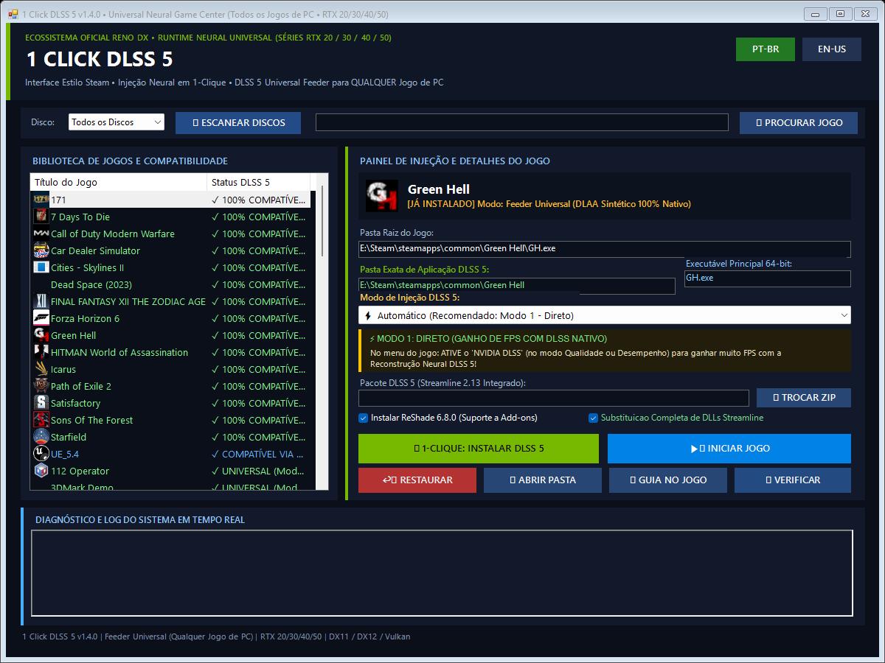

# 1 Click DLSS 5 🚀

**Universal Neural Rendering Game Center & 1-Click Injector**  
*Empowering ANY PC Game (DX11/DX12/Vulkan/OpenGL) & All NVIDIA GeForce RTX 20, 30, 40 & 50 Series GPUs with DLSS 5 Neural Reconstruction*

[-9B51E0.svg)](https://github.com/reiluisii/1-Click-DLSS5)

 

 

[English](#english) • [Português (Brasil)](#português-brasil)

---

## English

### 🌟 Overview

**1 Click DLSS 5** is an all-in-one, automated Neural Rendering game center and injection engine for Windows. Built for the entire **NVIDIA GeForce RTX lineup (RTX 20, RTX 30, RTX 40 & RTX 50 Series)**, it introduces **Universal Feeder 2.0 Mode**, enabling DLSS 5 Neural Reconstruction in **virtually ANY PC game** (DirectX 11, DirectX 12, Vulkan, and OpenGL) with **100% Native Resolution (DLAA)** or **Dynamic Sub-Native Scaling (50%–100%)** without requiring native game upscaler integration.

---

### 🎮 The 3 Operating Modes

| Mode | Target Games | Injection Stack | Resolution Modes | In-Game Setting |
| :--- | :--- | :--- | :--- | :--- |
| **1. Direct Mode** | Games with native DLSS (*Cyberpunk 2077*, *Control*, *Forza*, *Witcher 3*) | NVIDIA Streamline 2.13 + `renodx-dlss5.addon64` + `nvngx_dlssnr.dll` | DLSS Quality / Balanced / Performance | **Enable DLSS** in game menu |
| **2. OptiScaler Bridge** | Games with FSR 2/3 or XeSS only (*God of War*, *The Last of Us*) | OptiScaler v0.9.4 (`version.dll`) + `renodx-dlss5.addon64` + `nvngx_dlssnr.dll` | FSR2/XeSS Redirected to DLSS 5 | **Enable FSR2/XeSS** in Quality mode |
| **3. Universal Feeder 2.0** 🆕 | **ALL OTHER GAMES** (*Green Hell*, *FF XII*, *Elden Ring*, *Dark Souls*, *Skyrim*, *GTA V*, etc.) | `dlss5-feed.addon64` (Engine v0.7.0) + LumeniteFX Kernel Optical Flow + `renodx-dlss5.addon64` + `nvngx_dlssnr.dll` | **100% Native DLAA** or **Dynamic Scaling (50%–100%)** | **Keep Upscaling OFF** (100% Native + TAA) |

---

### ⌨️ In-Game Controls & Hotkeys

* **`[F6]`**: Toggle DLSS 5 Neural Rendering **ON / OFF in real-time** for immediate same-frame comparisons!
* **`[F5]`**: Capture uncompressed A/B comparison screenshot.
* **`[Home]` / `[Pos1]`**: Open ReShade / RenoDX in-game overlay menu for fine-tuning.

---

### 💡 Pro-Tip for Maximum Fluidity (V-Sync Recommendation)
* **Disable In-Game V-Sync**: In games using the Unity Engine or certain DirectX pipelines, in-game V-Sync can cause frame pacing stalls when coupled with post-process neural injection. Disabling in-game V-Sync unlocks buttery smooth 80+ FPS presentations.
* **Tear-Free Gaming**: Use **NVIDIA G-Sync / FreeSync** or set a global Max Frame Rate limit in the **NVIDIA Control Panel** for flawless frame pacing.

---

### ⚡ What's New in v1.4.0 (Universal Feeder 2.0 Edition)

#### 🚀 Upgraded Universal Feeder Engine (v0.7.0)
- **Eliminated GPU Wedges / Driver TDR Crashes**: Both host and client now drain GPU queues and signal fences safely to `UINT64_MAX` upon exit or settings changes, resolving `nvlddmkm 153` driver resets.
- **Fixed Washed-out Image & Lifted Blacks (Vulkan / D3D12)**: Replaced sRGB-converting blits with raw byte copies (`vkCmdCopyImage`), preserving original game contrast and deep blacks.
- **Adjustable Work Resolution (50% – 100% Scaling)**: Run DLSS 5 Neural Reconstruction at a fraction of native resolution for massive performance gains on demanding titles, or keep it at 100% Native DLAA.
- **OpenGL Support (32-bit & 64-bit)**: Extended injection support to OpenGL titles via `GL_EXT_external_objects_win32` texture and fence sharing.
- **1:1 RenoDX Overlay Synchronization**: In-game menu now mirrors RenoDX settings directly and no longer overwrites default RenoDX configurations. Focus-stealing during host restart has been eliminated.

#### 🛡️ Rock-Solid Stability & Universal Hardware
- Retains the battle-tested RenoDX stable detour build (zero flickering, no swapchain race conditions).
- Retains universal `nvngx_dlssnr.dll` (158 MB) with full support for **RTX 20, 30, 40, and 50 Series** GPUs.
- **100% Clean Factory Restoration**: 1-click restore purges all injected addons, shaders, and configs, restoring original game files cleanly.

---

### 👥 Credits & Open-Source Ecosystem Attribution

We would like to express our deepest gratitude to the brilliant developers, researchers, and open-source projects that make **1 Click DLSS 5** possible:

| Component / Library | Authors & Maintainers | Role in 1 Click DLSS 5 | Upstream Source & License |
| :--- | :--- | :--- | :--- |
| **NVIDIA DLSS & Streamline** | **NVIDIA Corporation** | Neural Reconstruction model (`nvngx_dlssnr.dll`), DLSS SDK, and Streamline framework. | [NVIDIA Streamline](https://github.com/NVIDIAGameWorks/Streamline) • NVIDIA SDK License |
| **RenoDX Add-on** | **ShortFuse (`clshortfuse`) & Krish** | ReShade Add-on framework for DirectX hook detouring, DLSS parameter exposure, and tone mapping. | [clshortfuse/renodx](https://github.com/clshortfuse/renodx) • MIT License |
| **DLSS5-Feeder Engine** | **Jean-Luc Rouzies (`jlrouzies-fr`) & `@Phroster`** | Synthetic DLAA motion vector/depth feeder, cross-API texture bridging (D3D11/D3D12/Vulkan/OpenGL), and 32-bit IPC host. | [jlrouzies-fr/DLSS5-Feeder](https://github.com/jlrouzies-fr/DLSS5-Feeder) • MIT License |
| **OptiScaler** | **Çağın Özdil (`cdozdil`)** | Universal upscaling bridge for non-DLSS games with FSR2/XeSS support (`version.dll`). | [cdozdil/OptiScaler](https://github.com/cdozdil/OptiScaler) • MIT License |
| **ReShade** | **Crosire (`crosire`) & ReShade Team** | Generic post-processing injector and Add-on API runtime framework. | [crosire/reshade](https://github.com/crosire/reshade) • BSD 3-Clause |
| **LumeniteFX Kernel** | **Fubax & Lumenite Team** | High-precision temporal optical flow motion estimation compute shaders. | [Fubax/LumeniteFX](https://github.com/Fubax/LumeniteFX) • MIT License |
| **Intel® XeSS SDK** | **Intel Corporation** | Intel Xe Super Sampling runtime (`libxess.dll`) utilized in OptiScaler bridge. | [intel/xess](https://github.com/intel/xess) • Intel Community License |
| **AMD FidelityFX™** | **Advanced Micro Devices (AMD)** | FSR 2 / FSR 3 API abstraction and scaling standards. | [GPUOpen-LibrariesAndSDKs/FidelityFX-SDK](https://github.com/GPUOpen-LibrariesAndSDKs/FidelityFX-SDK) • MIT License |

---

### 📋 System Requirements

* **GPU:** NVIDIA GeForce RTX Series (RTX 2060+, RTX 3050+, RTX 4060+, RTX 50-Series)
* **OS:** Windows 10 / Windows 11 (64-bit)
* **Graphics API:** DirectX 11, DirectX 12, Vulkan, or OpenGL
* **Storage:** ~380 MB free disk space for runtime payload

---

 

## Português (Brasil)

### 🌟 Visão Geral

O **1 Click DLSS 5** é uma central completa e automatizada de injeção e gerenciamento de Renderização Neural DLSS 5 para Windows. Projetado para **toda a linha NVIDIA GeForce RTX (Séries RTX 20, RTX 30, RTX 40 e RTX 50)**, a versão 1.4.0 introduz o **Modo Feeder Universal 2.0**, permitindo rodar a Reconstrução Neural DLSS 5 em **praticamente QUALQUER jogo de PC** (DirectX 11, DirectX 12, Vulkan e OpenGL) em **Resolução 100% Nativa (DLAA)** ou com **Escalonamento Dinâmico (50%–100%)** sem precisar de suporte nativo no jogo.

---

### 🎮 Os 3 Modos de Operação Inteligentes

| Modo | Jogos Alvo | Pilha de Injeção | Modo de Resolução | Configuração no Jogo |
| :--- | :--- | :--- | :--- | :--- |
| **1. Modo Direto** | Jogos com DLSS nativo (*Cyberpunk 2077*, *Control*, *Forza*, *Witcher 3*) | NVIDIA Streamline 2.13 + `renodx-dlss5.addon64` + `nvngx_dlssnr.dll` | DLSS Qualidade / Balanceado / Desempenho | **Ative o DLSS** no menu do jogo |
| **2. Ponte OptiScaler** | Jogos apenas com FSR 2/3 ou XeSS (*God of War*, *The Last of Us*) | OptiScaler v0.9.4 (`version.dll`) + `renodx-dlss5.addon64` + `nvngx_dlssnr.dll` | FSR2/XeSS Redirecionado para DLSS 5 | **Ative FSR2/XeSS** em modo Qualidade |
| **3. Feeder Universal 2.0** 🆕 | **TODOS OS OUTROS JOGOS** (*Green Hell*, *FF XII*, *Elden Ring*, *Dark Souls*, *Skyrim*, *GTA V*, etc.) | `dlss5-feed.addon64` (Motor v0.7.0) + Fluxo Óptico LumeniteFX Kernel + `renodx-dlss5.addon64` + `nvngx_dlssnr.dll` | **DLAA 100% Nativo** ou **Escalonamento (50%–100%)** | **Deixe Upscaling DESLIGADO** (Nativo + TAA) |

---

### ⌨️ Teclas de Atalho no Jogo

* **`[F6]`**: Liga / Desliga o DLSS 5 **em tempo real** para comparar o antes e depois no mesmo frame!
* **`[F5]`**: Captura screenshot sem compressão para comparação A/B.
* **`[Home]` / `[Pos1]`**: Abre o menu completo do ReShade / RenoDX para ajustes finos.

---

### 💡 Dica de Ouro para Fluidez Máxima (Recomendação de VSync)
* **Desative o V-Sync dentro do Jogo**: Em jogos desenvolvidos na Unity Engine ou em certos pipelines DirectX, o V-Sync interno do jogo pode travar a entrega de frames (stalling da swapchain) quando combinado com pós-processamento neural. Desativar o VSync interno libera 80+ FPS fluidos e constantes.
* **Sem cortes de tela (Tearing)**: Utilize **G-Sync / FreeSync** ou limite a taxa máxima de quadros diretamente no **Painel de Controle da NVIDIA**.

---

### ⚡ Novidades da Versão 1.4.0 (Edição Feeder Universal 2.0)

#### 🚀 Motor DLSS5-Feeder Atualizado (v0.7.0)
- **Fim dos Travamentos de GPU (Fix TDR nvlddmkm 153)**: Drenagem segura das filas GPU e sinalização de *fences* ao fechar o jogo ou aplicar ajustes, eliminando congelamentos de tela.
- **Correção de Cores Lavadas / Pretos Claros em Vulkan & D3D12**: Transição para cópia bruta de bytes (`vkCmdCopyImage`) sem conversão indevida de sRGB, mantendo pretos profundos e contraste perfeito.
- **Escalonamento de Resolução Ajustável (Slider 50% – 100%)**: Permite rodar a reconstrução neural interna em resolução reduzida para mais FPS em jogos pesados, ou manter em 100% Nativo (DLAA).
- **Suporte a OpenGL (32-bit e 64-bit)**: Compatibilidade com jogos clássicos e emuladores baseados em OpenGL.
- **Menu In-Game Sincronizado 1:1 com RenoDX**: A interface do Feeder espelha exatamente as opções do RenoDX e não sobrescreve configurações padrão. Correção no foco da janela ao reiniciar o helper process.

#### 🛡️ Estabilidade Absoluta e Suporte Universal a Hardware
- Mantém a build estável e comprovada do RenoDX (zero piscamentos ou congelamentos).
- Mantém o runtime neural universal `nvngx_dlssnr.dll` (158 MB) com suporte nativo a **RTX 20, 30, 40 e 50**.
- **Restauração de Fábrica 100% Limpa**: O botão Restaurar remove com segurança todos os arquivos injetados (addons, shaders, configs) e recupera os executáveis originais.

---

### 👥 Créditos & Reconhecimento ao Ecossistema Open-Source

Expressamos nossa sincera gratidão aos desenvolvedores, pesquisadores e projetos de código aberto que tornam o **1 Click DLSS 5** possível:

| Componente / Biblioteca | Autores e Mantenedores | Função no 1 Click DLSS 5 | Repositório Oficial e Licença |
| :--- | :--- | :--- | :--- |
| **NVIDIA DLSS & Streamline** | **NVIDIA Corporation** | Modelo Neural Reconstruction (`nvngx_dlssnr.dll`), SDK do DLSS e Streamline framework. | [NVIDIA Streamline](https://github.com/NVIDIAGameWorks/Streamline) • Licença NVIDIA SDK |
| **RenoDX Add-on** | **ShortFuse (`clshortfuse`) & Krish** | Add-on para ReShade de hooks DirectX, exposição de parâmetros DLSS e tone mapping. | [clshortfuse/renodx](https://github.com/clshortfuse/renodx) • Licença MIT |
| **DLSS5-Feeder Engine** | **Jean-Luc Rouzies (`jlrouzies-fr`) & `@Phroster`** | Feeder de DLAA sintético, vetores de movimento/profundidade, ponte D3D11/D3D12/Vulkan/OpenGL e IPC 32-bit. | [jlrouzies-fr/DLSS5-Feeder](https://github.com/jlrouzies-fr/DLSS5-Feeder) • Licença MIT |
| **OptiScaler** | **Çağın Özdil (`cdozdil`)** | Ponte universal para jogos com suporte a FSR2/XeSS (`version.dll`). | [cdozdil/OptiScaler](https://github.com/cdozdil/OptiScaler) • Licença MIT |
| **ReShade** | **Crosire (`crosire`) & Equipe ReShade** | Injetor genérico de pós-processamento e arquitetura de Add-ons. | [crosire/reshade](https://github.com/crosire/reshade) • Licença BSD 3-Clause |
| **LumeniteFX Kernel** | **Fubax & Equipe Lumenite** | Shaders compute de fluxo óptico temporal de alta precisão. | [Fubax/LumeniteFX](https://github.com/Fubax/LumeniteFX) • Licença MIT |
| **Intel® XeSS SDK** | **Intel Corporation** | Runtime do Intel Xe Super Sampling (`libxess.dll`) utilizado na ponte OptiScaler. | [intel/xess](https://github.com/intel/xess) • Licença Intel Community |
| **AMD FidelityFX™** | **Advanced Micro Devices (AMD)** | Padrões e abstrações de API do FSR 2 e FSR 3. | [GPUOpen-LibrariesAndSDKs/FidelityFX-SDK](https://github.com/GPUOpen-LibrariesAndSDKs/FidelityFX-SDK) • Licença MIT |

---

### 📋 Requisitos de Sistema

* **Placa de Vídeo:** Linha NVIDIA GeForce RTX (RTX 2060+, RTX 3050+, RTX 4060+, Série RTX 50)
* **Sistema Operacional:** Windows 10 ou Windows 11 (64 bits)
* **API Gráfica:** DirectX 11, DirectX 12, Vulkan ou OpenGL
* **Armazenamento:** ~380 MB de espaço em disco para o payload completo

---

### 🛡️ License & Disclaimer / Licença & Isenção de Responsabilidade

Distributed under the [MIT](LICENSE) License. / Distribuído sob a licença [MIT](LICENSE).

This project is an open-source research and modding tool developed for educational, enhancement, and compatibility purposes. NVIDIA, DLSS, Streamline, GeForce, RTX, OptiScaler, ReShade, and RenoDX are trademarks or registered trademarks of their respective owners.
