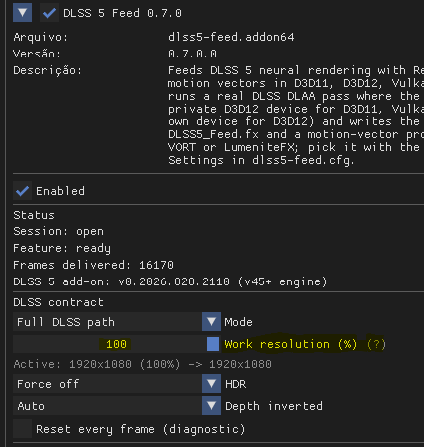

# 1 Click DLSS 5 🚀

<div align="center">

**Universal Neural Rendering Game Center & 1-Click Injector**  
*Empowering ANY PC Game (DX11 / DX12 / Vulkan / OpenGL) & All NVIDIA GeForce RTX 20, 30, 40 & 50 Series GPUs with DLSS 5 Neural Reconstruction*

[](https://github.com/reiluisii/1-Click-DLSS5)
[](LICENSE)
[](https://github.com/reiluisii/1-Click-DLSS5)
[](https://github.com/reiluisii/1-Click-DLSS5)
[](https://nvidia.com)
[-9B51E0.svg)](https://github.com/reiluisii/1-Click-DLSS5)
[](https://github.com/reiluisii/1-Click-DLSS5)
[](https://github.com/reiluisii/1-Click-DLSS5)

<br>


</div>

---

## 🌟 What is 1 Click DLSS 5?

**1 Click DLSS 5** is an all-in-one, standalone Neural Rendering desktop game center and automated injection tool for Windows. Designed for the entire **NVIDIA GeForce RTX lineup (RTX 20, 30, 40, and 50 Series)**, it democratizes **DLSS 5 Neural Reconstruction** by bringing real-time AI-enhanced lighting, reflection stability, and pristine edge anti-aliasing to **virtually ANY PC game**—regardless of whether the game natively supports DLSS, FSR, XeSS, or no upscaler at all.

---

## 🔍 How the Game Center Works (Under the Hood)

The application operates as a standalone Steam-style game manager with zero background telemetry:

1. **Automatic Multi-Drive Game Library Discovery:**
   * Recursively scans all connected drives (Steam, Epic Games Store, GOG Galaxy, EA App, Ubisoft Connect, Xbox App, and custom install directories).
   * Parses executable headers via Win32 PE extraction to retrieve real high-resolution game icons and determine binary bitness (64-bit vs 32-bit).

2. **Intelligent Upscaler & Engine Detection:**
   * Scans game directories for graphic APIs and upscaling runtimes:
     * **Native DLSS Detected:** Finds `nvngx_dlss.dll`, `nvngx_dlssd.dll`, `sl.dlss.dll`, or `_nvngx.dll`.
     * **FSR 2 / 3 Detected:** Finds `ffx_fsr2_api*.dll`, `ffx_fsr3_api*.dll`, `amd_fidelityfx*.dll`, or `FSR2.dll`.
     * **XeSS Detected:** Finds `libxess.dll` or `xess.dll`.
     * **DirectX / Vulkan / OpenGL:** Detects rendering engine characteristics for games with no built-in upscalers.

3. **1-Click Smart Deployment & Clean State Management:**
   * Automatically selects the optimal injection mode, backs up original game files to a hidden safety directory, and applies pre-configured, flicker-free profiles.
   * Provides **100% factory restoration** with a single click, cleanly removing all injected files.

---

## 🎮 The 3 Smart Operating Modes

```
                               ┌──► [Mode 1: Direct] ──────► Native DLSS Games (Cyberpunk, Forza, Control)
                               │
[1-Click DLSS 5 Auto-Detect] ──┼──► [Mode 2: Bridge] ──────► FSR2/XeSS Games (God of War, The Last of Us)
                               │
                               └──► [Mode 3: Feeder 2.0] ──► ALL OTHER GAMES (Green Hell, FF XII, Elden Ring, etc.)
```

| Mode | Target Games | Injection Stack | Resolution Modes | In-Game Setup |
| :--- | :--- | :--- | :--- | :--- |
| **1. Direct Mode** | Games with native DLSS (*Cyberpunk 2077*, *Control*, *Forza*, *Witcher 3*) | NVIDIA Streamline 2.13 + `renodx-dlss5.addon64` + `nvngx_dlssnr.dll` | DLSS Quality / Balanced / Performance | **Enable DLSS** in game graphics menu |
| **2. OptiScaler Bridge** | Games with FSR 2/3 or XeSS only (*God of War*, *The Last of Us*, *Avatar*) | OptiScaler v0.9.4 (`version.dll`) + `renodx-dlss5.addon64` + `nvngx_dlssnr.dll` | FSR2/XeSS redirected to DLSS 5 | **Enable FSR2 or XeSS** in Quality mode |
| **3. Universal Feeder 2.0** 🆕 | **ALL OTHER GAMES** (*Green Hell*, *FF XII*, *Elden Ring*, *Dark Souls*, *Skyrim*, *GTA V*, etc.) | `dlss5-feed.addon64` (Engine v0.7.0) + LumeniteFX Kernel + `renodx-dlss5.addon64` + `nvngx_dlssnr.dll` | **100% Native DLAA** or **Dynamic Scaling (50%–100%)** | **Keep in-game upscalers OFF** (Native + TAA) |

---

## ⚡ Dynamic Work Resolution Scaling (50% – 100% FPS Boost)

With the upgraded **DLSS5-Feeder v0.7.0** engine, Universal Feeder Mode now features a **Dynamic Work Resolution Scaling** slider!

<div align="center">



*Adjust the `Work resolution (%)` slider inside the ReShade `[Home]` overlay to balance performance and fidelity.*

</div>

### How It Works:
* **100% Work Resolution (Default / Native DLAA):** Runs the full DLSS 5 Neural Reconstruction pass directly on 100% native screen resolution with zero downsampling blur, delivering maximum texture crispness and stable temporal geometry.
* **50% – 90% Work Resolution (Performance Scaling):** Renders the internal neural pass at a fraction of the screen resolution while keeping the HUD and backbuffer native. Motion vectors scale proportionally and depth is point-sampled to preserve silhouette fidelity, yielding massive FPS boosts in demanding titles!

---

## 🚀 Key Improvements in v1.5.0 (Universal Feeder 2.0)

* **🛡️ Eliminated GPU Wedges & Driver TDR Crashes (v0.6.1/v0.7.0):**
  GPU queues and synchronization fences are now properly drained and signaled to `UINT64_MAX` upon exiting or applying settings, resolving `nvlddmkm 153` driver resets.
* **🎨 Fixed Washed-Out Images & Lifted Blacks in Vulkan / D3D12:**
  Switched from sRGB-converting blits to raw byte copies (`vkCmdCopyImage`), preserving accurate black levels and authentic scene contrast.
* **🕹️ Added OpenGL Support (32-bit & 64-bit):**
  Enables DLSS 5 injection on classic games, emulators, and OpenGL engines via cross-API memory object sharing (`GL_EXT_external_objects_win32`).
* **🎛️ 1:1 In-Game UI Alignment with RenoDX:**
  Feeder overlay menu mirrors RenoDX settings directly and no longer overwrites default configurations.
* **🛑 Automatic Overlay & Tutorial Suppression:**
  ReShade starts completely silently with no first-time banners or tutorial popups.
* **📁 Clean Layperson Folder Hierarchy:**
  Internal scripts, payloads, and assets are housed in `core/`, providing a single-click entry point (`1-Click-DLSS5.vbs`) with zero flashing terminal windows.

---

## ⌨️ In-Game Controls & Hotkeys

* **`[F6]`**: Toggle DLSS 5 Neural Rendering **ON / OFF in real-time** for instant same-frame comparison.
* **`[F5]`**: Capture uncompressed A/B screenshot comparisons.
* **`[Home]` / `[Pos1]`**: Open the ReShade, RenoDX, and DLSS 5 Feeder in-game settings overlay.

---

## 💡 Pro-Tip for Maximum Fluidity (V-Sync Recommendation)

* **Disable In-Game V-Sync:** In games built on the Unity Engine or certain DirectX swapchains, in-game V-Sync can cause frame pacing stalls when post-process neural compute passes execute on the command queue. Disabling in-game V-Sync unlocks smooth 80+ FPS presentations.
* **Tear-Free Experience:** Use **NVIDIA G-Sync / FreeSync** or set a global Max Frame Rate limit inside the **NVIDIA Control Panel** for stutter-free frame pacing.

---

## 👥 Credits & Open-Source Attribution

We express our deepest gratitude to the visionary developers and open-source projects that make **1 Click DLSS 5** possible:

| Component / Library | Authors & Maintainers | Role in 1 Click DLSS 5 | Upstream Project & License |
| :--- | :--- | :--- | :--- |
| **NVIDIA DLSS & Streamline** | **NVIDIA Corporation** | Neural Reconstruction runtime (`nvngx_dlssnr.dll`), DLSS SDK, and Streamline framework. | [NVIDIA Streamline](https://github.com/NVIDIAGameWorks/Streamline) • NVIDIA SDK License |
| **RenoDX Add-on** | **ShortFuse (`clshortfuse`) & Krish** | ReShade Add-on framework for DirectX hook detouring, DLSS parameter exposure, and tone mapping. | [clshortfuse/renodx](https://github.com/clshortfuse/renodx) • MIT License |
| **DLSS5-Feeder Engine** | **Jean-Luc Rouzies (`jlrouzies-fr`) & `@Phroster`** | Synthetic DLAA motion vector/depth feeder, cross-API texture bridging (D3D11/D3D12/Vulkan/OpenGL), and 32-bit IPC host. | [jlrouzies-fr/DLSS5-Feeder](https://github.com/jlrouzies-fr/DLSS5-Feeder) • MIT License |
| **OptiScaler** | **Çağın Özdil (`cdozdil`)** | Universal upscaling bridge for non-DLSS games with FSR2/XeSS support (`version.dll`). | [cdozdil/OptiScaler](https://github.com/cdozdil/OptiScaler) • MIT License |
| **ReShade** | **Crosire (`crosire`) & ReShade Team** | Generic post-processing injector and Add-on API runtime framework. | [crosire/reshade](https://github.com/crosire/reshade) • BSD 3-Clause |
| **LumeniteFX Kernel** | **Fubax & Lumenite Team** | High-precision temporal optical flow motion estimation compute shaders. | [Fubax/LumeniteFX](https://github.com/Fubax/LumeniteFX) • MIT License |
| **Intel® XeSS SDK** | **Intel Corporation** | Intel Xe Super Sampling runtime (`libxess.dll`) utilized in OptiScaler bridge. | [intel/xess](https://github.com/intel/xess) • Intel Community License |
| **AMD FidelityFX™** | **Advanced Micro Devices (AMD)** | FSR 2 / FSR 3 API abstraction and scaling standards. | [GPUOpen-LibrariesAndSDKs/FidelityFX-SDK](https://github.com/GPUOpen-LibrariesAndSDKs/FidelityFX-SDK) • MIT License |

---

## 📋 System Requirements & Quick Start

### Requirements:
* **GPU:** NVIDIA GeForce RTX Series (RTX 2060+, RTX 3050+, RTX 4060+, RTX 50-Series)
* **OS:** Windows 10 or Windows 11 (64-bit)
* **Graphics API:** DirectX 11, DirectX 12, Vulkan, or OpenGL
* **Disk Space:** ~430 MB free disk space

### Quick Start:
1. Download and extract **`1-Click-DLSS5-v1.5.0.zip`**.
2. Double-click **`1-Click-DLSS5.vbs`** to open the Game Center (no terminal window will open).
3. Select your game from the library or click **Browse Game**.
4. Click **🚀 1-CLICK INSTALL DLSS 5** and launch your game!

---

## 🛡️ License & Disclaimer

Distributed under the [MIT](LICENSE) License.

*This project is an open-source research and modding tool developed for educational, enhancement, and compatibility purposes. NVIDIA, DLSS, Streamline, GeForce, RTX, OptiScaler, ReShade, and RenoDX are trademarks or registered trademarks of their respective owners.*
