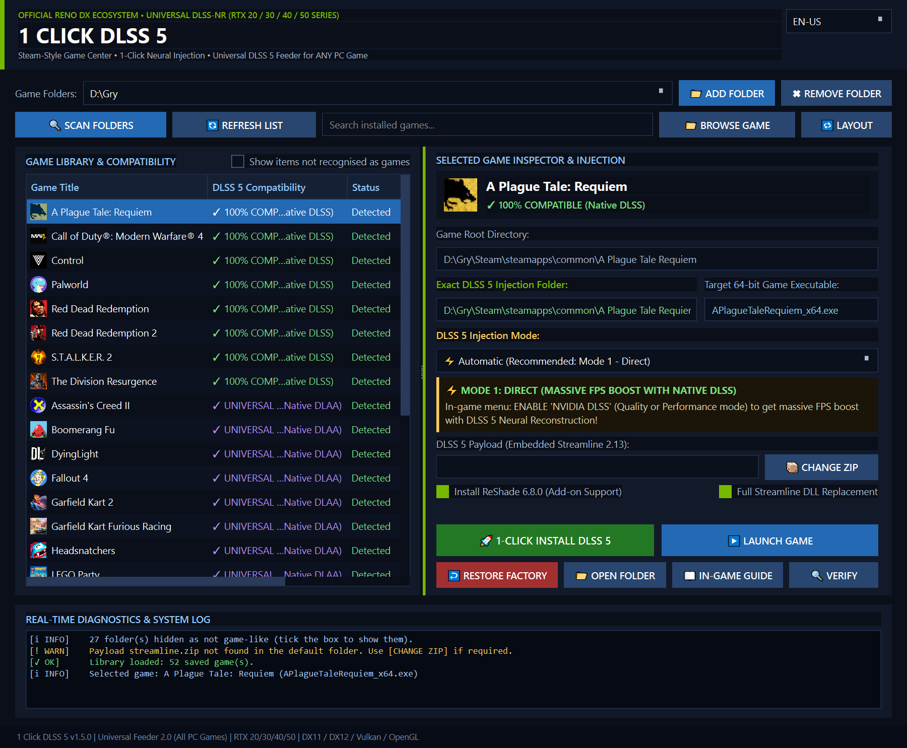

# 1 Click DLSS 5 — Python Edition 🐍

<div align="center">

**A PySide6 rewrite of the 1 Click DLSS 5 injector**
*Same injection behaviour, rebuilt as a testable Python core with a Qt interface*

[](https://github.com/kamilos876/1-Click-DLSS5-Py)
[](LICENSE)
[](https://github.com/kamilos876/1-Click-DLSS5-Py)
[](https://www.python.org/)
[](https://doc.qt.io/qtforpython/)
[](python/core/i18n.py)

<br>



</div>

---

## What this fork is

This is a fork of [reiluisii/1-Click-DLSS5](https://github.com/reiluisii/1-Click-DLSS5),
adding a **Python port of the installer** under [`python/`](python/).

The upstream project ships a single large PowerShell script. This port keeps the
same injection behaviour but splits it into a `core/` layer that runs and tests
without Qt, and a `ui/` layer on top of it. The original PowerShell edition is
still here, untouched, in [`core/1-Click-DLSS5.ps1`](core/1-Click-DLSS5.ps1).

**For what the tool actually does** — DLSS 5 neural reconstruction, the three
injection modes, the compatibility matrix — read the
[upstream README](https://github.com/reiluisii/1-Click-DLSS5). This page covers
the Python edition only.

---

## Quick start

```bash
pip install -r python/requirements.txt
python python/main.py
```

On Windows, [`python/run.cmd`](python/run.cmd) does both steps for you: it
checks for Python, installs PySide6 if missing, and launches the app.

Injection writes into game folders, so the app relaunches itself elevated when
the target needs administrator rights.

### Command line

```
python main.py [--lang EN|PL|PT] [--game PATH] [--version]
```

`--help` and `--version` never start Qt, so they work on a machine without
PySide6 installed.

---

## Requirements

| | |
|---|---|
| OS | Windows 10 / 11 (x64) |
| Python | 3.10 or newer |
| Dependency | PySide6 ≥ 6.5 (the only one) |
| GPU | NVIDIA RTX 20 / 30 / 40 / 50 series |

---

## Architecture

```
python/
  main.py          entry point, argument parsing
  core/            injection logic — importable and testable without Qt
    constants.py     version, payload lists, API mappings, game profiles
    detection.py     resolving the game binary, upscaler family, graphics API
    installer.py     install / restore / state file handling
    payload.py       ZIP extraction and ReShade installation
    reshade_ini.py   rewriting ReShade.ini and the Feeder preset
    scanner.py       multi-drive game library discovery
    messages.py      log message keys in PL / EN / PT
  ui/              PySide6 layer
    main_window.py   the game center window
    workers.py       background threads for scanning and installing
    theme.py         dark palette and styling
  tests/           13 test modules
```

The split is the point of the port. `core/` never decides what language the user
reads or which widget shows a result: it emits message keys, which the UI renders.
That is what makes the install and restore paths testable on synthetic game
folders, with no Qt event loop and no real game on disk.

---

## Tests

```bash
cd python
python tests/run_all.py
```

13 modules covering executable and graphics-API detection, install/restore round
trips against synthetic game folders, `ReShade.ini` rewriting, translation-table
integrity (59 log keys × 3 languages), and Qt layout at several window sizes.

---

## Payload

The port reads the same payload folder as the PowerShell edition —
`core/payload/` since v1.5.0, with the older top-level `payload/` layout still
detected automatically.

`streamline.zip` is the one piece not committed here (excluded for size). Drop it
into `core/payload/` and it is picked up on startup. Without it, Direct and
Feeder modes report a missing package.

---

## What the port adds

The injection logic matches upstream. These are things the Python edition does
that the PowerShell one does not:

**A library that persists.** Scan results are saved to `library.json` and reload
instantly on the next launch, with a *Refresh* pass that re-checks what is still
on disk, follows executables that moved between patches, and flags what is gone
rather than deleting it. The PowerShell edition rescans from scratch every time.

**A UI that stays responsive.** Scanning, refreshing and installing each run on
their own `QThread` and report back through signals, behind a progress dialog;
a long scan or refresh can be cancelled while it runs. The PowerShell edition
scans on the UI thread, so the window freezes for the duration.

**Polish, alongside English and Portuguese.** Upstream ships EN and PT. Because
the core emits message keys instead of sentences, adding a language is a table,
not a rewrite — and a test asserts all three stay in sync.

**A library you can navigate.** Live search, games ordered by how well they will
take the injection, a switchable side-by-side / stacked layout, and folders that
are only guesses kept behind a *show items not recognised as games* toggle
instead of cluttering the list.

**Real game icons.** Icons are extracted from the executables themselves. Two
Win32 details are handled that otherwise silently cost a game its icon: icon
handles above 2^31, and icons that carry a 1-bit mask instead of an alpha
channel — those decode as fully colored but fully transparent, drawing as
nothing at all.

**Automatic elevation.** The app detects when a target folder needs
administrator rights and relaunches itself elevated, rather than failing midway
through an install.

### One deliberate behaviour change

**Feeder mode no longer deletes the proxy DLL it just installed.** In the
PowerShell edition, a D3D12 or Unreal title gets ReShade installed as
`d3d12.dll`, and the Feeder conflict-purge list then removes that same file a
few lines later — leaving the Feeder unable to load. The port protects the proxy
written by the current run.

---

## Credits

All the reverse engineering, the injection strategy, the Feeder add-on and the
shader work are upstream's. This fork contributes a Python port of the installer
around them.

* [reiluisii/1-Click-DLSS5](https://github.com/reiluisii/1-Click-DLSS5) — the original project
* [ReShade](https://reshade.me/) by crosire — the add-on runtime
* [RenoDX](https://github.com/clshortfuse/renodx) by clshortfuse
* [OptiScaler](https://github.com/cdozdil/OptiScaler) by cdozdil
* NVIDIA — DLSS and the Streamline SDK

---

## License

Distributed under the [MIT](LICENSE) License, following upstream.

*This project is an open-source research and modding tool developed for
educational, enhancement, and compatibility purposes. NVIDIA, DLSS, Streamline,
GeForce, RTX, OptiScaler, ReShade, and RenoDX are trademarks or registered
trademarks of their respective owners.*
