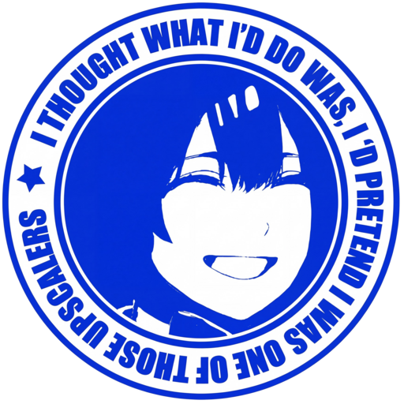

# 1 Click DLSS 5 🚀

**Universal Neural Rendering Game Center & 1-Click Injector**  
*Empowering RTX 40 & RTX 50 Series GPUs with Next-Generation DLSS 5 Neural Reconstruction*

[English](#english) • [Português (Brasil)](#português-brasil)

---

## English

### 🌟 Overview

**1 Click DLSS 5** is an all-in-one, automated Neural Rendering game center and injection engine designed for Windows. Built for NVIDIA GeForce RTX 40 & RTX 50 Series graphics cards, it provides a modern Steam-style visual library, automatic game discovery across all drives, real-time `.exe` icon extraction, intelligent heuristic subfolder resolution (`Retail\`, `bin\x64\`, `Binaries\Win64\`), and seamless 1-click installation of next-generation DLSS 5 Neural Reconstruction models powered by RenoDX (`renodx-dlss5.addon64`), NVIDIA Streamline 2.13, and the bundled OptiScaler v0.9.4 Universal Bridge.

---

### ⚡ What's New in v1.2.0

* **🌉 Universal Mode / OptiScaler Bridge:** Automatically detects the upscaler technologies present in the game and applies the optimal method:
  * **Games with native DLSS:** Direct injection of NVIDIA Streamline 2.13 + `renodx-dlss5.addon64`.
  * **Games with FSR 2.x / XeSS only:** Universal OptiScaler Bridge (installs OptiScaler v0.9.4 as `version.dll` and ReShade as `dxgi.dll`), seamlessly translating FSR2/XeSS calls to DLSS-NR neural reconstruction.
  * **Games without any upscaler:** Blocked with clear, informative diagnostic guidance explaining requirements.
* **🛡️ Confirmation Dialogs:** Interactive confirmation prompts before both installation and factory restoration/uninstallation to prevent accidental changes.
* **🔍 Installed State Detection:** Real-time detection showing whether DLSS 5 is already installed on the selected game, along with the active deployment mode.
* **↩️ Granular Backup & Restore:** Complete file tracking per installation mode, ensuring 100% clean factory restoration without leaving orphan files or causing file corruption.
* **🧩 Add-on Pipeline Standardization:** Uses the official `renodx-dlss5.addon64` runtime for maximum stability and compatibility.
* **📦 Bundled OptiScaler v0.9.4:** Pre-configured and optimized out of the box for zero overlay conflicts and low latency.
* **🐛 Bug Fixes & Polish:** Resolved language toggle synchronization issues, corrected compatibility badge detection, and improved multi-drive scanning speed.

---

### ✨ Key Features

* **🎮 Steam-Style Game Library:** Automatically scans all fixed drives (`C:`, `D:`, `E:`, etc.) for installed games (Steam, Epic Games, Xbox Game Pass, GOG, EA, Ubisoft, or custom folders) and ranks them by compatibility.
* **🖼️ Real In-Game Executable Icons:** Extracts high-resolution embedded application icons straight from 64-bit game binaries in real time.
* **🎯 Fail-Proof Path & Executable Detection:** Smart heuristic resolver eliminates anti-cheat wrappers (`EasyAntiCheat`, `BattlEye`, `Vanguard`), crash handlers, launchers, and server binaries to target the exact 64-bit game executable.
* **⚡ Dual-Mode 1-Click Neural Injection:** Injects official `renodx-dlss5.addon64`, `nvngx_dlssnr.dll`, Streamline 2.13 runtime modules, or OptiScaler v0.9.4 bridge files in under a second.
* **▶️ Direct Game Launcher:** Launch your game directly from the installer interface immediately after applying mods.
* **↩️ Clean 1-Click Factory Restore:** Automatically creates safety backups of original files and wipes all injected modules on demand with zero file corruption.
* **🌐 Real-Time Bilingual HUD:** Instant toggle between English (`EN-US`) and Portuguese (`PT-BR`).

---

### 🚀 Quick Start Guide

1. **Download & Extract:** Download the latest `1-Click-DLSS5.zip` release and extract it to a folder.
2. **Launch:** Double-click **`1-Click-DLSS5.cmd`** (or right-click `1-Click-DLSS5.ps1` -> *Run with PowerShell*).
3. **Select Your Game:** Pick any game from your visual library or click `[📁 BROWSE GAME]`.
4. **Install:** Click the bright green **`[🚀 1-CLICK INSTALL DLSS 5]`** button and confirm the installation prompt.
5. **Launch & Play:** Click **`[▶️ LAUNCH GAME]`**.
6. **In-Game Activation:**
   * **Graphics Menu:**
     * *Native DLSS games:* Make sure **NVIDIA DLSS Super Resolution** is set to *Quality* or *Performance*.
     * *FSR2 / XeSS games:* Set **AMD FSR 2** or **Intel XeSS** to *Quality* or *Performance* (OptiScaler will bridge the inputs to DLSS-NR).
   * **Overlay Menu:**
     * Press the **`[Home]`** key on your keyboard to open the in-game overlay.
     * Navigate to the **Add-ons** tab -> expand **DLSS 5** -> choose **NR Preset #2** and **NR Style: Cinematic**.

---

### 📋 Compatibility Matrix

| Game / Category | Method | In-Game Setting | Notes |
| :--- | :---: | :---: | :--- |
| **Native DLSS games** *(Cyberpunk 2077, Forza Horizon 5/6, HITMAN WoA, etc.)* | `Direct` | NVIDIA DLSS | Auto-detected. Direct Streamline 2.13 + `renodx-dlss5.addon64` injection. |
| **FSR2 games** *(God of War, Horizon Zero Dawn, The Last of Us Part I, etc.)* | `OptiScaler Bridge` | AMD FSR 2 | Auto-detected. OptiScaler v0.9.4 (`version.dll`) translates FSR2 to DLSS-NR. |
| **XeSS games** *(Shadow of the Tomb Raider, Dying Light 2, etc.)* | `OptiScaler Bridge` | Intel XeSS | Auto-detected. OptiScaler v0.9.4 (`version.dll`) translates XeSS to DLSS-NR. |
| **Unreal Engine 4/5** *(Black Myth: Wukong, S.T.A.L.K.E.R. 2, etc.)* | `Direct or Bridge` | DLSS / FSR2 / XeSS | Auto-detected. Injects into `Binaries\Win64\` using optimal method. |
| **No upscaler games** | `Not Supported` | N/A | Clear diagnostic message shown explaining upscaler requirement. |

---

 

## Português (Brasil)

### 🌟 Visão Geral

O **1 Click DLSS 5** é uma central completa e automatizada de injeção e gerenciamento de Renderização Neural DLSS 5 para Windows. Projetado para placas de vídeo NVIDIA GeForce Séries RTX 40 e RTX 50, oferece uma interface moderna no estilo biblioteca da Steam, varredura automática de jogos em todos os discos rígidos e SSDs, extração de ícones em alta resolução diretamente dos executáveis, detecção blindada de subpastas de injeção (`Retail\`, `bin\x64\`, `Binaries\Win64\`) e instalação em 1-clique dos modelos neurais de DLSS 5 baseados no ecossistema RenoDX (`renodx-dlss5.addon64`), NVIDIA Streamline 2.13 e a ponte universal OptiScaler v0.9.4 integrada.

---

### ⚡ Novidades da Versão 1.2.0

* **🌉 Modo Universal / Ponte OptiScaler:** Detecta automaticamente a tecnologia de upscaling suportada pelo jogo e aplica o método ideal:
  * **Jogos com DLSS nativo:** Injeção direta do NVIDIA Streamline 2.13 + `renodx-dlss5.addon64`.
  * **Jogos apenas com FSR 2.x / XeSS:** Ponte Universal OptiScaler (instala o OptiScaler v0.9.4 como `version.dll` e o ReShade como `dxgi.dll`), convertendo as chamadas de FSR2/XeSS para o modelo neural DLSS-NR.
  * **Jogos sem upscaler:** Bloqueio preventivo com diagnósticos claros e explicativos sobre os requisitos.
* **🛡️ Diálogos de Confirmação:** Avisos visuais de confirmação antes de instalar e antes de restaurar/desinstalar para evitar ações acidentais.
* **🔍 Detecção do Estado de Instalação:** Exibe em tempo real se o jogo já possui o DLSS 5 instalado e qual modo está ativo.
* **↩️ Backup e Restauração Aprimorados:** Rastreamento granular de cada arquivo instalado em ambos os modos, garantindo restauração de fábrica 100% limpa e sem resíduos.
* **🧩 Padronização do Add-on:** Utiliza o módulo oficial `renodx-dlss5.addon64` para máxima estabilidade e compatibilidade.
* **📦 OptiScaler v0.9.4 Integrado:** Pré-configurado e otimizado para evitar conflitos de interface e garantir baixa latência.
* **🐛 Correções de Bugs & Interface:** Resolução de falhas na alternância de idioma, refinamento na detecção de badges de compatibilidade e otimização na velocidade de varredura de discos.

---

### ✨ Principais Recursos

* **🎮 Biblioteca Visual Estilo Steam:** Escaneia discos (`C:`, `D:`, `E:`, etc.) e exibe jogos da Steam, Epic Games, Xbox Game Pass, GOG, EA, Ubisoft e pastas personalizadas em ordem de compatibilidade.
* **🖼️ Ícones Oficiais em Tempo Real:** Extrai e renderiza os ícones reais de cada executável `.exe` de 64-bit do jogo.
* **🎯 Detecção Blindada de Executável:** Ignora instaladores, crash reporters da Unity/Unreal e wrappers de Anti-Cheat (`EasyAntiCheat`, `BattlEye`, `Vanguard`), selecionando o executável correto com 100% de precisão.
* **⚡ Injeção Neural em Dois Modos em 1-Clique:** Aplica os módulos `renodx-dlss5.addon64`, `nvngx_dlssnr.dll`, DLLs Streamline 2.13 ou os arquivos da ponte OptiScaler v0.9.4 em menos de um segundo.
* **▶️ Inicializador Direto de Jogos:** Abra o jogo imediatamente pelo botão azul `[ ▶️ INICIAR JOGO ]`.
* **↩️ Restauração de Fábrica em 1-Clique:** Cria backups de segurança dos arquivos originais e remove todos os módulos injetados sob demanda com zero corrupção de arquivos.
* **🌐 Interface Bilingue em Tempo Real:** Alternância instantânea entre Português (`PT-BR`) e Inglês (`EN-US`).

---

### 🚀 Guia de Uso Rápido

1. **Baixar e Extrair:** Baixe o arquivo `1-Click-DLSS5.zip` mais recente e extraia para uma pasta.
2. **Executar:** Dê dois cliques em **`1-Click-DLSS5.cmd`** (ou clique com o botão direito em `1-Click-DLSS5.ps1` -> *Executar com o PowerShell*).
3. **Escolha o Jogo:** Selecione o jogo na lista à esquerda ou clique em `[📁 PROCURAR JOGO]`.
4. **Instalar:** Clique no botão verde **`[🚀 INSTALAR DLSS 5 EM 1-CLIQUE]`** e confirme a caixa de diálogo.
5. **Abrir o Jogo:** Clique em **`[▶️ INICIAR JOGO]`**.
6. **No Jogo:**
   * **Menu Gráfico:**
     * *Jogos com DLSS Nativo:* Ative o **NVIDIA DLSS Super Resolution** (Qualidade ou Desempenho).
     * *Jogos com FSR2 / XeSS:* Ative o **AMD FSR 2** ou **Intel XeSS** (o OptiScaler redirecionará as chamadas para o DLSS-NR).
   * **Menu de Overlay:**
     * Pressione a tecla **`[Home]`** no teclado para abrir o menu do ReShade / RenoDX.
     * Acesse a aba **Add-ons** -> expanda **DLSS 5** -> selecione **NR Preset #2** e **NR Style: Cinematic**.

---

### 📋 Matriz de Compatibilidade

| Jogo / Categoria | Método | Opção no Jogo | Observações |
| :--- | :---: | :---: | :--- |
| **Jogos com DLSS Nativo** *(Cyberpunk 2077, Forza Horizon 5/6, HITMAN WoA, etc.)* | `Direto` | NVIDIA DLSS | Auto-detectado. Injeção direta de Streamline 2.13 + `renodx-dlss5.addon64`. |
| **Jogos com FSR2** *(God of War, Horizon Zero Dawn, The Last of Us Part I, etc.)* | `Ponte OptiScaler` | AMD FSR 2 | Auto-detectado. OptiScaler v0.9.4 (`version.dll`) converte FSR2 para DLSS-NR. |
| **Jogos com XeSS** *(Shadow of the Tomb Raider, Dying Light 2, etc.)* | `Ponte OptiScaler` | Intel XeSS | Auto-detectado. OptiScaler v0.9.4 (`version.dll`) converte XeSS para DLSS-NR. |
| **Jogos Unreal Engine 4 & 5** *(Black Myth: Wukong, S.T.A.L.K.E.R. 2, etc.)* | `Direto ou Ponte` | DLSS / FSR2 / XeSS | Auto-detectado. Injeta em `Binaries\Win64\` com o método ideal. |
| **Jogos sem upscaler** | `Não Suportado` | N/A | Mensagem clara de diagnóstico informando a necessidade de upscaler. |

---

### 🛡️ License & Disclaimer / Licença & Isenção de Responsabilidade

Distributed under the [MIT](LICENSE) License. / Distribuído sob a licença [MIT](LICENSE).  

*Disclaimer: This software is an independent utility and is not affiliated with, endorsed by, or sponsored by NVIDIA Corporation, AMD, or Intel. NVIDIA, DLSS, RTX, GeForce, Streamline, AMD, FSR, Intel, and XeSS are trademarks or registered trademarks of their respective owners.*  
*Aviso: Este software é uma ferramenta utilitária independente e não é afiliado, endossado ou patrocinado pela NVIDIA Corporation, AMD ou Intel. NVIDIA, DLSS, RTX, GeForce, Streamline, AMD, FSR, Intel e XeSS são marcas comerciais ou registradas de seus respectivos proprietários.*
